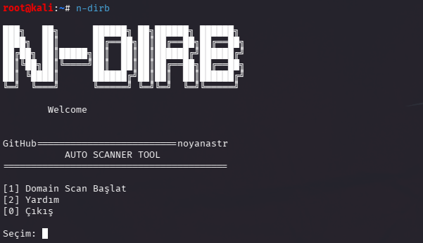

<div align="center">

# N-DIRB

```text
███╗   ██╗      ██████╗ ██╗██████╗ ██████╗
████╗  ██║      ██╔══██╗██║██╔══██╗██╔══██╗
██╔██╗ ██║█████╗██║  ██║██║██████╔╝██████╔╝
██║╚██╗██║╚════╝██║  ██║██║██╔══██╗██╔══██╗
██║ ╚████║      ██████╔╝██║██║  ██║██████╔╝
╚═╝  ╚═══╝      ╚═════╝ ╚═╝╚═╝  ╚═╝╚═════╝
```

### Network Recon Automation Tool

Simple reconnaissance automation tool written in Python.

</div>

---

# Screenshot



---

# Features

- Domain → IP Resolution
- ICMP Ping Scan
- Nmap Port Scanning
- Service & Version Detection
- Directory Enumeration with Dirb
- TXT Report Generation
- Interactive Terminal Menu
- Linux CLI Support

---

# Installation

## Clone Repository

```bash
git clone https://github.com/noyanastr/n-dirb.git
cd n-dirb
```

## Install Requirements

```bash
sudo apt update
sudo apt install python3 nmap dirb
```

---

# Usage

## Run Tool

```bash
python3 n-dirb.py
```

---

# Scan Flow

```text
Domain Input
     ↓
DNS Resolution
     ↓
Ping Scan
     ↓
Nmap Scan
     ↓
Directory Scan
     ↓
TXT Report Generation
```

---

# Report Output

Reports are automatically saved inside:

```text
reports/
```

Example:

```text
reports/example.com_report.txt
```

---

# Technologies Used

- Python3
- Nmap
- Dirb
- Linux
- Subprocess Automation

---

# Project Structure

```text
n-dirb/
│
├── n-dirb.py
├── README.md
├── requirements.txt
├── .gitignore
├── n-dirb-sc.png
│
└── reports/
```

---

# requirements.txt

```text
# External system tools required:
# nmap
# dirb
```

---

# .gitignore

```gitignore
reports/
__pycache__/
*.pyc
```

---

# Disclaimer

This tool is intended for educational purposes and authorized security testing only.

Unauthorized scanning of systems is illegal.

---

<div align="center">

### Developed by noyanastr

</div>
